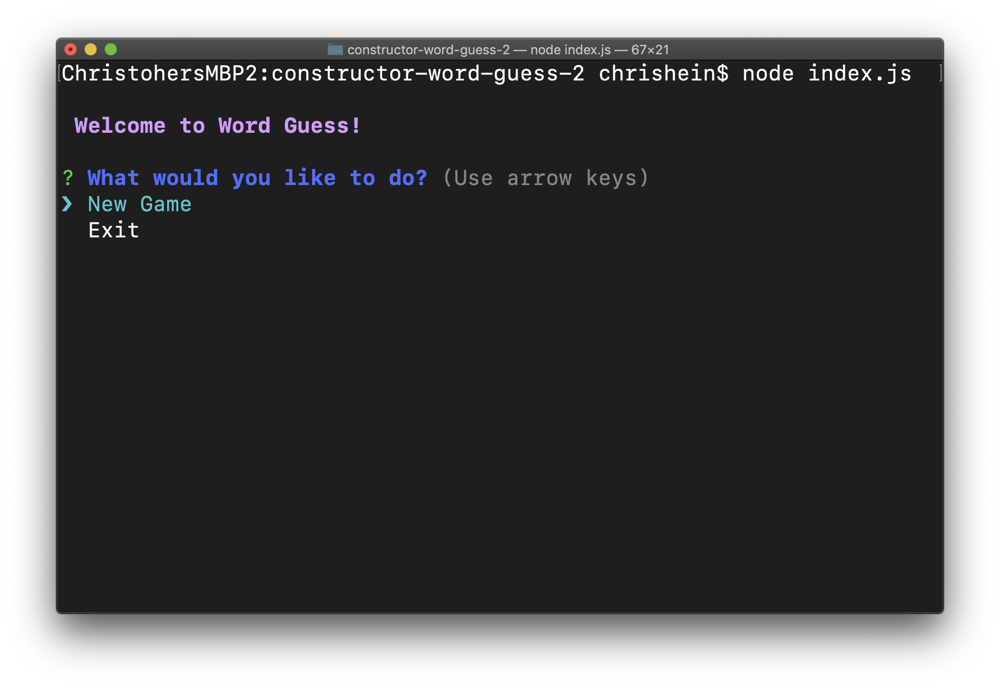
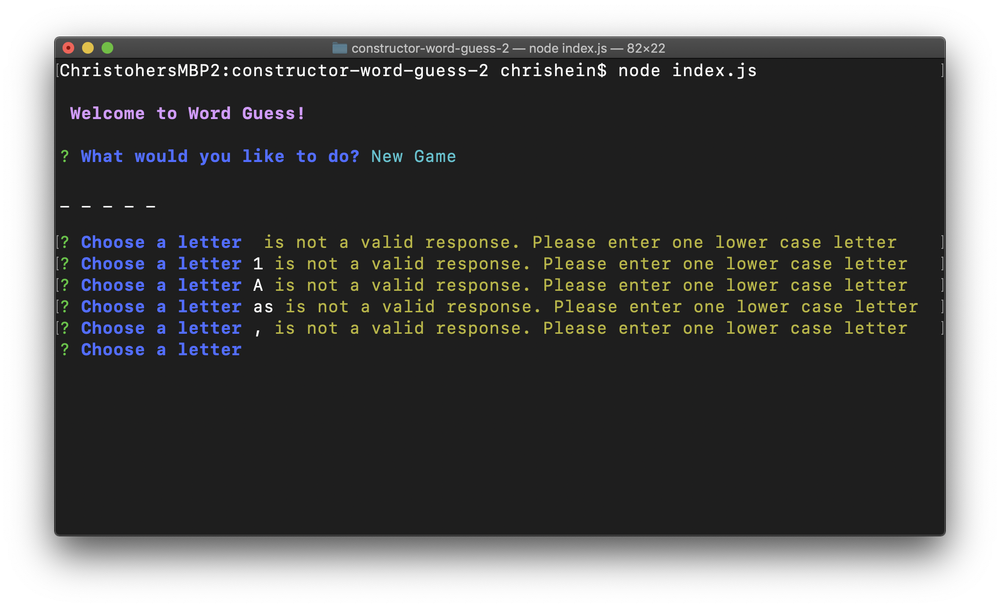
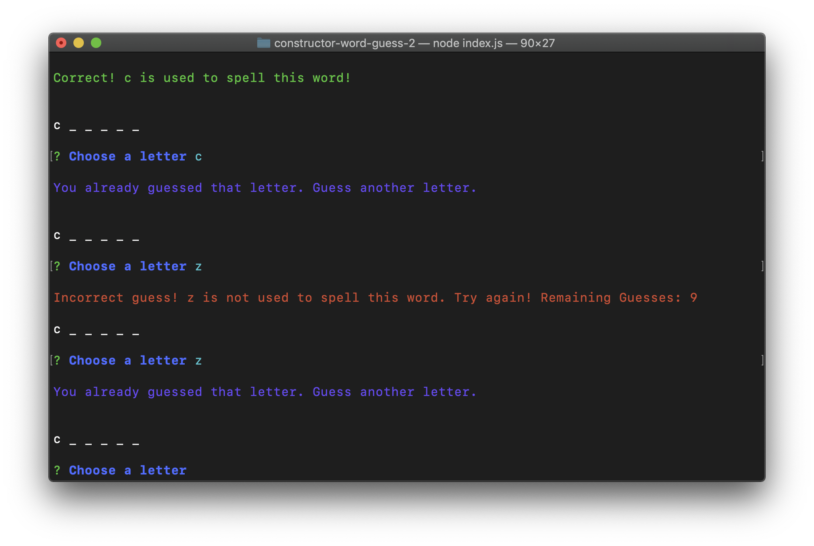
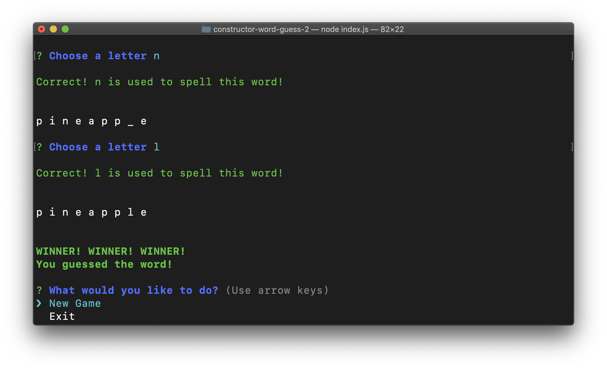
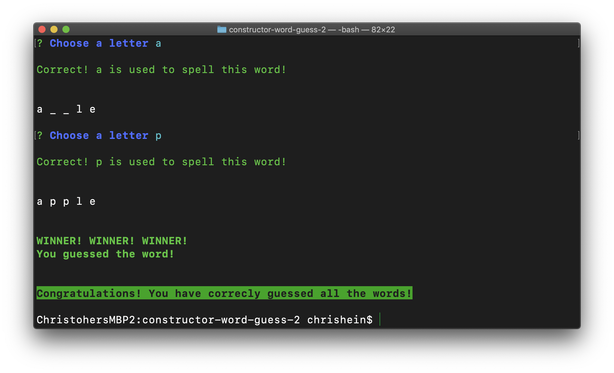
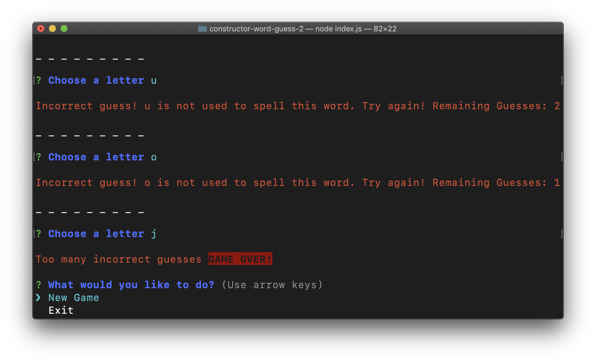
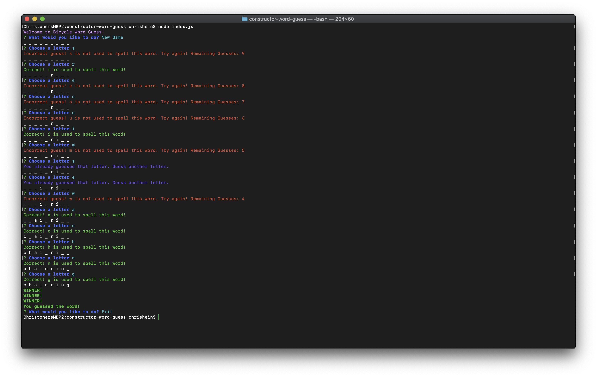
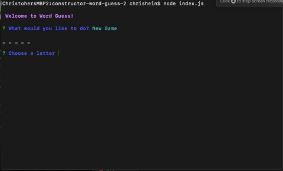
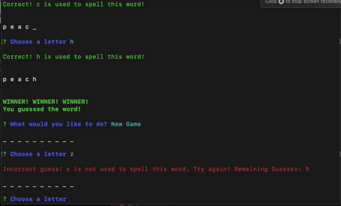

# Constructor Word Guess 2
Welcome to Constructor Word Guess 2. Constructor Word Guess 2 is a colorful CLI-based word guessing game. You can use this to easily create a word guessing game with whatever words you choose.

## Getting Started
To install on your local machine, run the following in your terminal:
```javascript
$ npm install constructor-word-guess-2
```
Create a .js file and use the following
```javascript
const wordGuess = require('constructor-word-guess-2');
```
#### Quick Start
Copy and paste the following into your index.js file:
```javascript
const WordGuess = require('constructor-word-guess-2');
let array = ['stringone', 'stringtwo', 'stringthree', 'stringfour'];

wordGuess(array);
```
To start the game, you must pass an array as an argument in your function. For example:

```javascript
let array = ['stringone', 'stringtwo', 'stringthree', 'stringfour'];

wordGuess(array);
```
#### Things to note
Arrays may only consist of alphabetic strings. Numbers, special characters, or spaces in a string will not allow the application to function properly.

### Game Play

Users will first be greeted with an option to play a new game or exit the game.



Upon selecting "New Game" users will start a new game and can begin guessing letters. 

Users may only enter one lowercase letter. If a user enters numbers, special characters, uppercase letters or multiple letters they will see an error message instructing them of their mistake. 


Additionally, users will be notified if they guess the same letter more than once.


When a user guesses all the letters of a word correctly, they will be notified that they have one and will be asked if they want to start a new game or exit. 


If a users guesses all of the words correctly, they will be shown a message saying they have guesed all the words correctly and the application will exit back to the terminal.


Should a user make 10 mistakes when guessing letters, they will lose the game and be offered the opportunity to either start a new game or exit. 


Exiting the game will take the user back to the terminal.


Below are some examples of what typical game play may look like.






### NPMs used
- [Inquirer](https://www.npmjs.com/package/inquirer)
- [Chalk](https://www.npmjs.com/package/chalk)